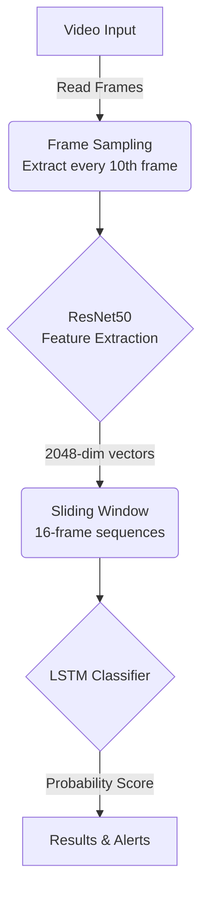

<div align="center">

# AlertVision: Violence Detection System

[](https://python.org/) [](https://tensorflow.org/) [](https://streamlit.io/) [](https://github.com/mchengny/RWF2000-Video-Database-for-Violence-Detection) [](#license)

**A real-time violence detection system powered by deep learning.** <br> AlertVision analyzes video feeds to detect violent activity using a **ResNet50 + LSTM** pipeline and sends automated email alerts when incidents are detected.

### 🚀 [Live Demo on Hugging Face Spaces](https://huggingface.co/spaces/dhruvsharma29/AlertVision)

</div>

---

<!-- ## Demo <div align="center">  </div> --- Uncomment this section once demo.gif is added to the repo root. -->

## Features

|Feature|Description|
|:--|:--|
|**Video File Analysis**|Upload video files (MP4, AVI, MOV, MKV) for offline violence detection|
|**Live Webcam Monitoring**|Real-time detection through live webcam feeds (local deployment only)|
|**Email Alerts**|Automated notifications with incident snapshots (local deployment only)|
|**Configurable Sensitivity**|Adjustable detection threshold via a built-in UI slider (0.1 – 0.9)|
|**Timestamped Snapshots**|Captured frames from detected incidents with burned-in timestamps|

> [!NOTE]
> Live webcam monitoring and email alerts are only available when running locally — Hugging Face Spaces blocks camera access and outbound SMTP ports.

---

## How It Works



1. **Frame Sampling** — Reads every 10th frame from the input video to optimize processing speed.
2. **Feature Extraction** — Each frame is resized to 224×224 and passed through a pre-trained **ResNet50** (ImageNet, `pooling="avg"`), producing a compressed 2048-dimensional feature vector.
3. **Sequence Classification** — A sliding window of 16 consecutive feature vectors is fed to the trained **LSTM classifier**, which analyzes the temporal motion and outputs a violence probability.
4. **Alerting** — If the probability exceeds the configured threshold, the system flags the sequence, captures incident snapshots, overlays timestamps, and optionally dispatches an email alert.

---

## Dataset: RWF-2000

The model was trained on the [RWF-2000 Dataset](https://github.com/mchengny/RWF2000-Video-Database-for-Violence-Detection), a large-scale video database for violence detection.

- **Total clips:** 2,000 (1,000 violent, 1,000 non-violent)
- **Source:** Real-world surveillance cameras (CCTV)
- **Duration:** ~5 seconds per clip

> [!NOTE] The complete training pipeline is available in the [`VDS.ipynb`](VDS.ipynb) notebook, originally trained on Google Colab.

---

## Getting Started

### Prerequisites

- Python 3.9+
- Git

### Installation

**1. Clone the repository**

```bash
git clone https://github.com/Dhruv-Sharma29/AlertVision-Violence-Detection-System.git
cd AlertVision-Violence-Detection-System
```

**2. Create a virtual environment**

```bash
python -m venv venv
source venv/bin/activate        # macOS/Linux
# venv\Scripts\activate         # Windows
```

**3. Install dependencies**

```bash
pip install -r requirements.txt
```

**4. Download model weights** Place the trained `best_lstm.h5` (or `best_lstm.keras`) inside a `models/` directory.

```bash
mkdir -p models
# Download and place your model weights here
```

### Configure Email Alerts (Optional)

To enable email notifications, create a `secrets.toml` file from the template:

```bash
cp .streamlit/secrets.toml.example .streamlit/secrets.toml
```

Edit `.streamlit/secrets.toml` with your credentials:

```toml
[email_credentials]
    SENDER_EMAIL = "your-email@gmail.com"
    SENDER_PASSWORD = "your-gmail-app-password"
```

> [!IMPORTANT] You must use a **[Gmail App Password](https://support.google.com/accounts/answer/185833)**, not your standard Gmail password, to allow the application to send emails.

### Run the Application

```bash
streamlit run app.py
```

The application will launch automatically in your browser at `http://localhost:8501`.

---

## Project Structure

```text
AlertVision/
├── app.py                          # Main Streamlit application
├── VDS.ipynb                       # Training notebook (Google Colab)
├── requirements.txt                # Python pip dependencies
├── environment.yml                 # Conda environment definition
├── models/                         # Trained model weights (not in repo)
│   └── best_lstm.h5
├── .streamlit/
│   ├── config.toml                 # Streamlit UI theme configuration
│   └── secrets.toml.example        # Email credential template
├── .gitignore                      # Ignored files (models, datasets, etc.)
└── README.md                       # Project documentation
```

---

## Tech Stack

|Component|Technology|
|:--|:--|
|**Frontend UI**|[Streamlit](https://streamlit.io/)|
|**Feature Extraction**|ResNet50 (TensorFlow / Keras)|
|**Temporal Classifier**|LSTM (TensorFlow / Keras)|
|**Image Processing**|OpenCV, Pillow|
|**Training Environment**|Google Colab|

---

## Team

<div align="center">

|<a href="https://github.com/Dhruv-Sharma29"><br /><sub><b>Dhruv Sharma</b></sub></a><br />|<a href="https://github.com/Shivanshu890"><br /><sub><b>Shivanshu Bhandari</b></sub></a><br />|<a href="https://github.com/kartikeykashyap2006"><br /><sub><b>Kartikey Kashyap</b></sub></a><br />|
|:-:|:-:|:-:|

</div>

---

## License

This project is for educational and research purposes.